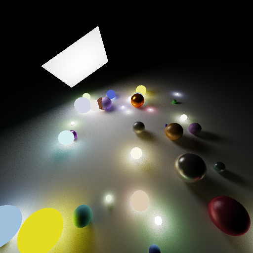

# C++ Raytracer
A simple raytracer written in C++.

## Renders

Here is a simple render. It took about 365 seconds to render.

## Installation

To start you are going to need vcpkg.

    $ vcpkg install pngpp
    $ vcpkg install glm
    $ git clone https://github.com/MyUsernamee/Raytracer.git
    $ cd Raytracer
    $ cmake . -DCMAKE_TOOLCHAIN_FILE=~/vcpkg/scripts/buildsystems/vcpkg.cmake
    $ make

Then it should build.