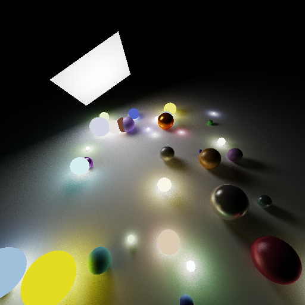
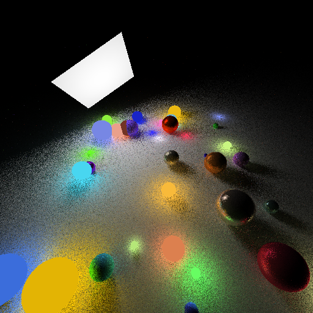

# C++ Raytracer
A simple raytracer written in C++.

## Renders

Here is a simple render. It took about 365 seconds to render.

## Installation

To start you need to run the following commands:
    
    sudo chmod +x instaldeps.sh
    ./instaldeps.sh

## Usage

    ./build.sh
    cd build
    ./Raytracer

Result with be in 

Then it should build.